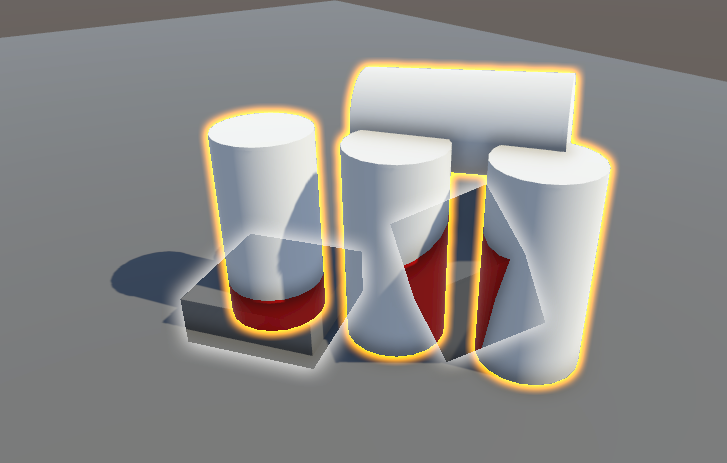
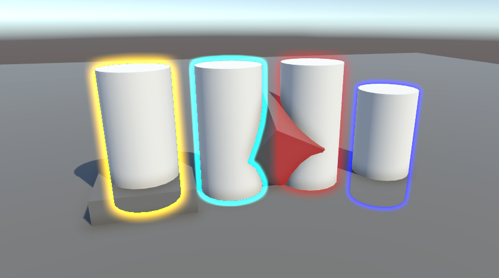

Project inspired by and based on [Arvtesh/UnityFx.Outline](https://github.com/Arvtesh/UnityFx.Outline).
  
# Installation (required)
1. Add _Outline Feature_ to renderer settings.
2. Set _Outline Shader_ to `./Shaders/outlineShader`.
3. Set _Masking Shader_ to `./Shaders/outlineMaskShader`.
4. Add a default material to render hidden parts with.

# Usage
## Per Layer

1. Set layer mask in _Outline Feature_ configuration. All objects in these layers will have outline enabled.
2. Configure other outline settings.

Overlapping objects' outlines will be combined when using layer-based mode. 

## Per Object

1. Add _Outline Effect_ component to an object. It must have any renderer (such as MeshRenderer) attached.
2. Configure outline settings for this object.

## Settings
| Setting&nbsp;&nbsp;&nbsp;&nbsp;&nbsp;&nbsp;&nbsp;&nbsp;&nbsp;&nbsp;&nbsp;&nbsp;&nbsp;&nbsp;&nbsp;&nbsp;&nbsp;&nbsp;&nbsp;&nbsp;&nbsp;&nbsp;&nbsp;&nbsp;&nbsp;&nbsp; |                                                                                                                                                                                                                                                                                                              |
|---------------------------------------------------------------------------------------------------------------------------------------------------------------------|--------------------------------------------------------------------------------------------------------------------------------------------------------------------------------------------------------------------------------------------------------------------------------------------------------------|
| Use global settings                                                                                                                                                 | (per-object mode only) Use settings from outline render feature                                                                                                                                                                                                                                              |
| Color                                                                                                                                                               | HDR Color for the outline                                                                                                                                                                                                                                                                                    |
| Outline Size                                                                                                                                                        | Change size of the outline to one of 3 available values                                                                                                                                                                                                                                                      |
| Flags                                                                                                                                                               | Enable special features                                                                                                                                                                                                                                                                                      |
| Flag : Use Depth                                                                                                                                                    | Enable depth tests to draw outline only around the visible part of the object                                                                                                                                                                                                                                |
| Flag : Show Hidden                                                                                                                                                  | Render the hiden part of the object using material set in Renderer settings                                                                                                                                                                                                                                  |
| - Override Hidden Material                                                                                                                                          | (Only when _Show Hidden_ flag is enabled) Use custom material for hidden parts of the object                                                                                                                                                                                                                 |
| Flag : Precise                                                                                                                                                      | (**Experimental**) Use if object is transformed with vertex shader. This feature will attempt to make the outline match the final shape of the object                                                                                                                                                        |
| - Shader Passes                                                                                                                                                     | (Only when _Precise_ flag is enabled) Set which shader passes to use when determining the shape of the object. By default all passes for all sub-meshes are used. If provided, a list of pass numbers must be provided for every submesh in order. Use pass number -1 to render all passes for that submesh. |

